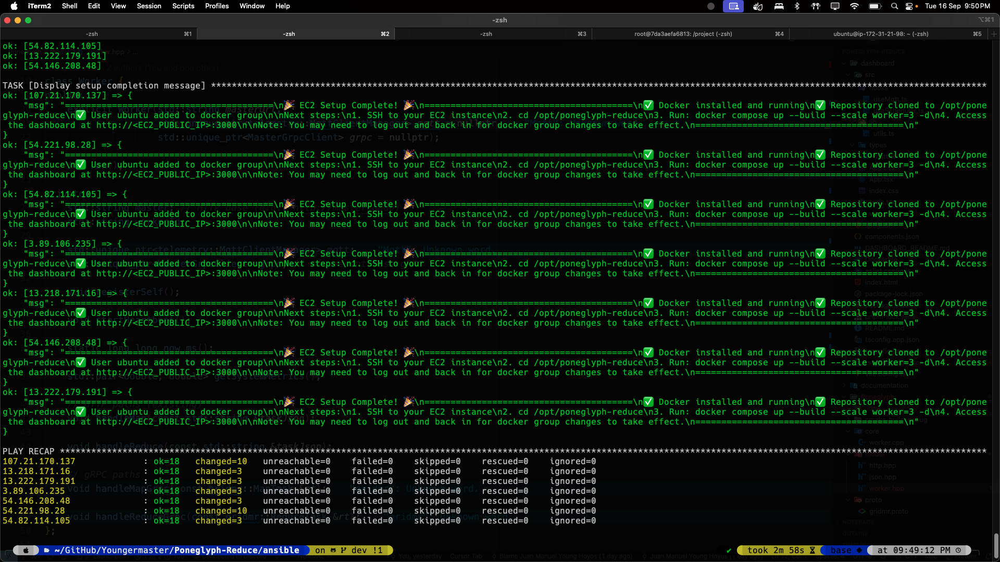

# 🚀 Ansible EC2 Setup for Poneglyph-Reduce

This Ansible playbook automates the complete setup of your EC2 instances for the **Poneglyph-Reduce** MapReduce cluster. It will:

✅ **Install Docker & Docker Compose**  
✅ **Clone the Poneglyph-Reduce repository**  
✅ **Set up proper permissions and dependencies**  
✅ **Prepare your EC2 for immediate deployment**

Perfect for deploying your MapReduce cluster across multiple EC2 instances with a single command!

## 1. Install Ansible

On your local machine or on a control machine that has access to the EC2 instance, you'll need to have Ansible installed.

```sh
sudo apt update
sudo apt install ansible -y
```

## 2. 📝 Configure Your EC2 Instances

### Step 1: Copy and customize the inventory file

```bash
cp hosts_example.ini hosts.ini
```

### Step 2: Edit `hosts.ini` with your EC2 details

```ini
[aws_ec2]
# Replace these placeholders with your actual values:
54.123.45.67 ansible_user=ubuntu ansible_ssh_private_key_file=~/.ssh/my-key.pem
18.234.56.78 ansible_user=ubuntu ansible_ssh_private_key_file=~/.ssh/my-key.pem
# Add more EC2 instances as needed...
```

**Important:** Make sure your `.pem` file has correct permissions:

```bash
chmod 400 ~/.ssh/my-key.pem
```

## 3. 🎯 What the Playbook Does

The `setup_ec2.yml` playbook performs these automated tasks:

1. **System Updates**: Updates all packages to latest versions
2. **Docker Installation**: Installs Docker CE, Docker Compose, and related tools
3. **User Setup**: Adds your user to the docker group
4. **Repository Clone**: Pulls the latest [Poneglyph-Reduce](https://github.com/Youngermaster/Poneglyph-Reduce) code
5. **Permissions**: Sets proper file permissions and ownership
6. **Dependencies**: Installs Git, Python3, and other required tools

## 4. 🚀 Deploy to Your EC2 Fleet

Run the playbook against all your EC2 instances:

```bash
ansible-playbook -i hosts.ini setup_ec2.yml
```

**Expected output:**


**Pro tip:** For verbose output, add `-v` or `-vvv` flags.

## 5. 🎉 Start Your MapReduce Cluster

After the playbook completes, SSH to any EC2 instance and run:

```bash
ssh -i ~/.ssh/my-key.pem ubuntu@<EC2_PUBLIC_IP>
cd /opt/poneglyph-reduce
docker compose up --build --scale worker=3 -d
```

Access your dashboard at: `http://<EC2_PUBLIC_IP>:3000`

## 6. 🔧 Advanced Configuration

### Security Group Requirements

Ensure your EC2 security group allows:

- **Port 22** (SSH) - for Ansible access
- **Port 8080** (HTTP) - for Master API
- **Port 3000** (HTTP) - for Dashboard access
- **Port 1883** (MQTT) - for real-time monitoring

### Multiple EC2 Deployment

To deploy across multiple regions or availability zones:

1. **Add multiple instances** to your `hosts.ini`:

```ini
[aws_ec2]
# Master node
ec2-master.us-east-1.amazonaws.com ansible_user=ubuntu ansible_ssh_private_key_file=~/.ssh/key.pem

# Worker nodes
ec2-worker1.us-east-1.amazonaws.com ansible_user=ubuntu ansible_ssh_private_key_file=~/.ssh/key.pem
ec2-worker2.us-west-2.amazonaws.com ansible_user=ubuntu ansible_ssh_private_key_file=~/.ssh/key.pem
```

2. **Run the playbook** once to set up all instances
3. **Configure Master-Worker** networking in your docker-compose.yml

### Troubleshooting

- **Permission denied?** Check your `.pem` file permissions: `chmod 400 ~/.ssh/my-key.pem`
- **Connection timeout?** Verify security group allows SSH (port 22)
- **Git clone fails?** EC2 instance needs internet access
- **Docker group issues?** Log out and back in after running the playbook

## 🌟 Benefits

✅ **One-command deployment** across multiple EC2 instances  
✅ **Consistent environment** setup across all nodes  
✅ **Version control** for infrastructure changes  
✅ **Idempotent operations** - safe to run multiple times  
✅ **Scalable** - easily add more EC2 instances to your cluster

Perfect for **distributed MapReduce** deployments! 🚀
